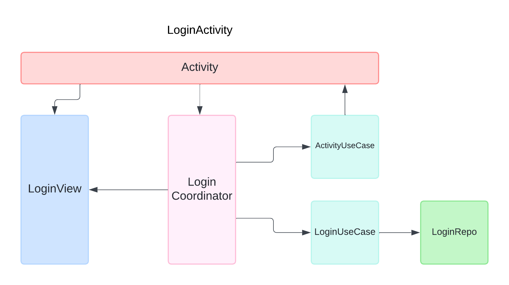

# Nanameue Test App

### Running the app

The app is a normal app with no external building dependencies outside of android studio.

The google-services.json file is removed to prevent leaks and needs to be added to the app directory. 

`app/google-services.json`

This was provided in the email for this test app.

## Login

The app already has a series of users and posts pre-created but more can be created as needed.

The usernames and passwords for the test users are in the email for this app.

## Backend

The app uses firebase auth for logging users in with a email and password.

Firebase firestore is used for the database and FirebaseStorage is used for holding image uploads.

## Libraries

The project is written in Kotlin and using uses gradle version catalogs.

- Dagger 2
- Jetpack compose
- Coil (Image loading)
- Androidx Compat libraries when needed
- Junit5 for unit testing
- Junit4 for android tests
- Mockk for mocking

## Code Structure
The project is a single module project.

The code for each Activity is in a separate sub package in the features package with the classes scoped to that activity using dagger components.

The Application scoped code is in the app package with the classes for each data type in sub packages.

## Screen Architecture

The App uses two different architecture patterns as a demonstration. 

#### PostActivity
1. The PostActivity is written using MVVN and compose navigation for the timeline and create post screens.

    - The `PostScreenViewModel` handles the shared work for the smaller screens
    -  `PostsTimelineViewModel` loads the list of posts
    -  `PostsTimelineViewModel` creates new posts

#### LoginActivity
2. The login screen uses a modified MVP I call VCUC (View-Coordinator-Use Case) as a demo.

    - The View is a separated view class that uses compose to create the UI but is updated using methods and not a state.
    - The Use Cases load and manage data from the repos at teh application level.
    - The Coordinator manages the lifecycle and relaying of data and events between the Use Cases and the view

#### Application
3. Data loading code for the screens is managed at teh application level and follows the repository pattern.

    - The Main entry is the repository which is exposed to the data consumers
    - The repositories depend on an API class to wrap the raw data source. In this case firebase.

 

 ## Storage Library

 In the project is a storage library I wrote for my projects. Its unused here but I have left it in the storage package.

 ## Testing
 The app has unit and instrumentation tests.

 Due to time constraints I was unable to add test for every class but I added a selection of tests including 
 
- Junit5 tests
- ParameterizedTests to cover a range of checks with one test
- Compose view tests in MVVM and VCUC architectures

